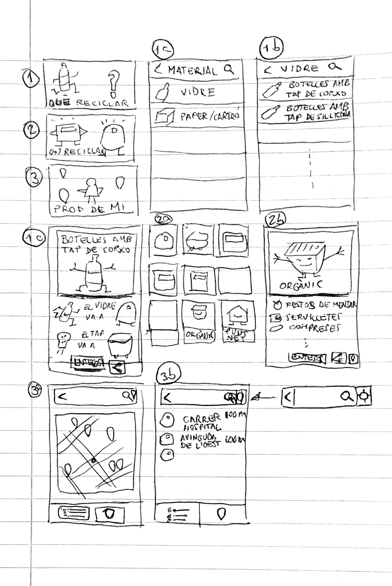

# reciclaVLC
App móvil para encontrar los contenedores de reciclaje más próximos en Valencia. La app vendrá complementada con instrucciones sobre dónde se debe reciclar cada residuo.

El público objetivo son COMODONES -aquellos que ya se sienten predispuestos a reciclar pero que por pereza o desconocimiento no lo hacen- y el PUBLICO INFANTIL.

He aquí los primeros diseños de la app, que tendrá una estética limpia y divertida.

